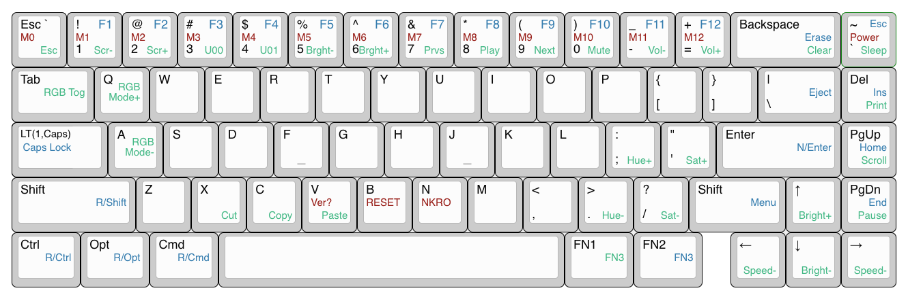

# @[vinorodrigues](https://github.com/vinorodrigues)' KBD67 Lite keymap

- Right most column from top to bottom is: Grave, Delete, PgUp, PgDn, Right
- Right of space is two FN keys: FN1 & FN2, press both for FN3
- Press and hold Caps-Lock => FN1
