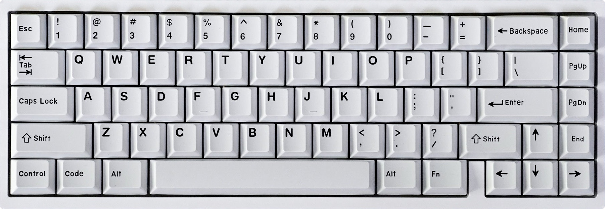

# KBDFans KBD67 Lite R2

A hotswap 65% keyboard.

* Keyboard Maintainer:
    * [Vino Rodrigues](https://github.com/vinorodrigues) *(this build)*
    * [moyi4681](https://github.com/moyi4681) *(original)*
* Hardware Supported: KBD67 Mk.II RGB V3 (*a.k.a.,* KBD67 Lite R2)
* Hardware Availability: [KBDFans](https://kbdfans.com/)

> Please read the [setup instructions / README.md](docs/README.md) on the docs page to enable this build on your installation of QMK.

Make example for this keyboard (after setting up your build environment):

    make custom/kbdfans_kbd67_lite:default

Flashing example for this keyboard:

    make custom/kbdfans_kbd67_lite:default:flash

See the [build environment setup](https://docs.qmk.fm/#/getting_started_build_tools) and the [make instructions](https://docs.qmk.fm/#/getting_started_make_guide) for more information. Brand new to QMK? Start with our [Complete Newbs Guide](https://docs.qmk.fm/#/newbs).

## Bootloader

Enter the bootloader in 3 ways:

* **Bootmagic reset**: Hold down the key at (0,0) in the matrix (usually the top left key or Escape) and plug in the keyboard
* **Physical reset button**: Briefly press the button on the back of the PCB - some may have pads you must short instead
* **Keycode in layout**: Press the key mapped to `RESET` if it is available
